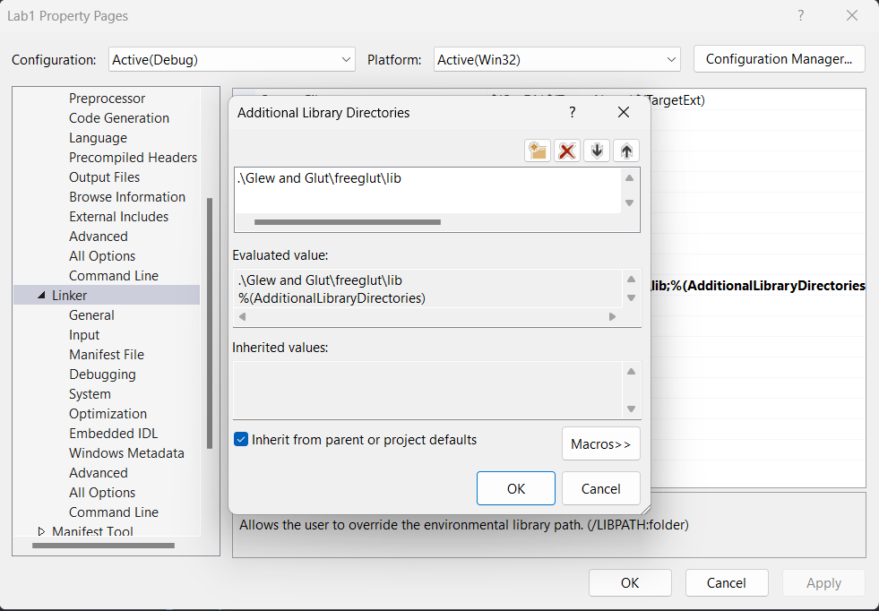

# Lab1

> Post on [Staler2019/NCU_3D_Graphic](https://github.com/Staler2019/NCU_3D_Graphic)

## Author

```
學號: 108502571
姓名: 楊佳峻
班級: 資工四A
```

## Environment Set Up

1. Open Visual Studio
2. Open Project's Property Page
3. `C++` -> `Additional Include Directories` add `.\Glew and Glut\freeglut\include`
   
4. `Linker` -> `Additional Library Directories` add `.\Glew and Glut\freeglut\lib`
   
5. `Linker` -> `Input` -> `Additional Dependencies` add `freeglut.lib`
   

## TODO

- [x] 畫點( d )

  滑鼠按下時，可以劃出任意圖形，放開時停止

- [x] 畫線( l )

  點擊第一次對應初始座標，點擊第二次對應終點座標。

- [x] 畫圓( o )

  點擊第一次對應圓心，第二次給出圓半徑

- [x] 多邊形( p )

  左鍵點擊對應多邊形的頂點，右鍵點擊完成封閉曲線

- [x] 清除(c)

  按下按鍵後清除屏幕上的圖形

- [x] undo(r)

  按下按鍵後回復清除前的狀態(一次就可以)

- [x] 結束程式(q)

  按下按鍵後關閉視窗。

- [x] 每個圖形賦予不同顏色
