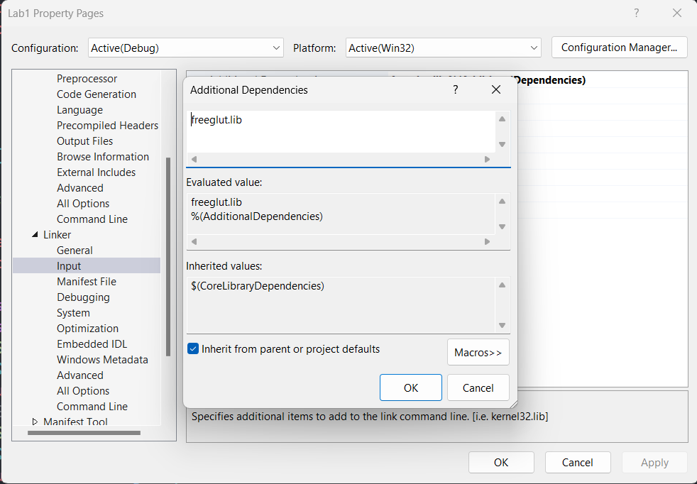

# Lab 2

> Post on [Staler2019/NCU_3D_Graphic](https://github.com/Staler2019/NCU_3D_Graphic)

## Author

```
學號: 108502571
姓名: 楊佳峻
班級: 資工四A
```

## Windows

### Set Up

1. Open Visual Studio 2022
2. Open Project's Property Page
3. `C++` -> `Additional Include Directories` add `.\Glew and Glut\freeglut\include`
   
4. `Linker` -> `Additional Library Directories` add `.\Glew and Glut\freeglut\lib`
   
5. `Linker` -> `Input` -> `Additional Dependencies` add `freeglut.lib`
   

## Build & Run

Select mode `x86` & Run

## Ubuntu

### Set Up

```.sh
sudo apt update && sudo apt install gcc g++ freeglut3-dev cmake
```

## Build & Run

```.sh
chmod 777 ./build.sh && chmod 777 ./run.sh
```

```.sh
./build.sh
```

```.sh
./run.sh
```

## TODO

### Lab 2

- [x] 註解(#)

  出現`#`時，不須執行該行的內容

- [x] reset

  清除`transform_matrix`

- [x] translate

  輸入的指令為 `translate x y`

  `x` 代表沿著`x`軸移動`x`單位
  `y` 代表沿著`y`軸移動`y`單位

- [x] scale

  輸入的指令為 `scale x y`

  `x` 代表沿著`x`軸縮放`x`單位
  `y` 代表沿著`y`軸縮放`y`單位

- [x] rotate

  輸入的指令為 `rotate` $\theta$

  $\theta$ 代表對著`z`軸旋轉$\theta$ **度**

- [x] clearData

  清除所創建的物件(square、triangle)

- [x] clearScreen

  清除畫面

- [x] view

  輸入的指令為 `view wxl wxr wyb wyt vxl vxr vyb vyt`

  `wxl wxr wyb wyt`所代表的是映射前的位置
  `vxl vxr vyb vyt`為映射後的位置

  簡單來說要符合

  $$
  f(wxl,wyb) = (vxl,vyb)\\
  f(wxr,wyt) = (vxr,vyt)\\
  $$

  $$
  where \quad f:R^2\rightarrow R^2 \quad is \quad a \quad linear \quad transformation
  $$

  在`view`外面的圖形要做剪裁

  每次`view`都需要把創建的物件`display`出來，請把圖形的邊界用點線描繪出來(利用`lab1`的`code`)

  請在每一次`display`東西出來時，加上`system("pause");`

  :warning: `Linux` 沒有 `system("pause");`，可以使用`fgetc(stdin);`代替 :warning:

  這次畫點的時候不需要 `height-y`

- [x] square

  創建一個頂點為 `(-1,-1)` `(1,-1)` `(1,1)` `(-1,1)` 的正方形

- [x] triangle

  創建一個頂點為 `(0,1)` `(-1,-1)` `(1,-1)` 的三角形

- [x] end

  結束視窗

- [x] 加分

  每個圖形內部填充顏色

### Lab 1

- [x] 畫點( d )

  滑鼠按下時，可以劃出任意圖形，放開時停止

- [x] 畫線( l )

  點擊第一次對應初始座標，點擊第二次對應終點座標。

- [x] 畫圓( o )

  點擊第一次對應圓心，第二次給出圓半徑

- [x] 多邊形( p )

  左鍵點擊對應多邊形的頂點，右鍵點擊完成封閉曲線

- [x] 清除(c)

  按下按鍵後清除屏幕上的圖形

- [x] undo(r)

  按下按鍵後回復清除前的狀態(一次就可以)

- [x] 結束程式(q)

  按下按鍵後關閉視窗。

- [x] 每個圖形賦予不同顏色

## New Learning Note

1. class args default value only put in class definition
2. `virtual` keyword of a class only put in class definition
3. `override` keyword of a class only put in class definition
4. use parent class pointer let different classes can be put in single vector
