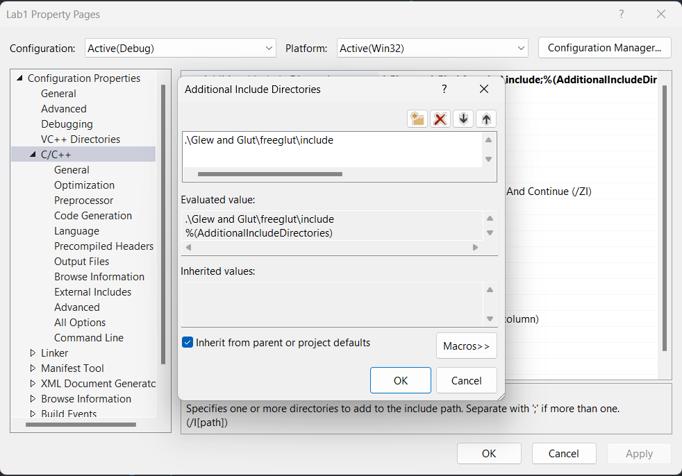

# Lab 4

> Post on [Staler2019/NCU_3D_Graphic](https://github.com/Staler2019/NCU_3D_Graphic)

## Author

```
學號: 108502571
姓名: 楊佳峻
班級: 資工四A
```

## Windows

### Set Up

1. Open Visual Studio 2022
2. Open Project's Property Page
3. `C++` -> `Additional Include Directories` add `.\Glew and Glut\freeglut\include`
   
4. `Linker` -> `Additional Library Directories` add `.\Glew and Glut\freeglut\lib`
   
5. `Linker` -> `Input` -> `Additional Dependencies` add `freeglut.lib`
   

### Build & Run

Select mode `x86` & Run

## Ubuntu

### Set Up

```.sh
sudo apt update && sudo apt install gcc g++ freeglut3-dev cmake gdb
```

### Build & Run

```.sh
chmod 777 ./build.sh && chmod 777 ./run.sh
```

```.sh
./build.sh
```

```.sh
./run.sh
```

## TODO

### Lab 4

- [x] 註解(#)

  出現`#`時，不須執行該行的內容

- [x] 開頭

  要注意開頭會給兩個數字，分別是`window`的`width`和`height`

- [x] reset

  清除`transform_matrix`

- [x] translate

  輸入的指令為 `translate x y z`

  `x` 代表沿著`x`軸移動`x`單位
  `y` 代表沿著`y`軸移動`y`單位
  `z` 代表沿著`z`軸移動`z`單位

- [x] scale

  輸入的指令為 `scale x y z`

  `x` 代表沿著`x`軸縮放`x`單位
  `y` 代表沿著`y`軸縮放`y`單位
  `z` 代表沿著`y`軸縮放`y`單位

- [x] rotate

  輸入的指令為 `rotate x y z`

  `x` 代表沿著`x`軸旋轉`x` 度
  `y` 代表沿著`y`軸旋轉`y` 度
  `z` 代表沿著`z`軸旋轉`z` 度

  :warning: 規定先對`y` 軸旋轉，再來是 `z` 軸，最後 `x`軸。 :warning:

- [x] clearData(use `cleardata`)

  清除所創建的物件(`obj`)

- [x] clearScreen

  清除畫面

- [x] viewport

  輸入的指令為 `view vxl vxr vyb vyt`

  因為經過 `perspective divide` 因此所有的圖形都會落在 [−1,1]×[−1,1]
  所以 $(wxl,wyb)=(−1,−1)$
  $(wxr,wyt)=(1,1)$

  `vxl vxr vyb vyt`為映射後的位置

  簡單來說要符合

  $$
  f(wxl,wyb) = (vxl,vyb)\\
  f(wxr,wyt) = (vxr,vyt)\\
  $$

  $$
  where \quad f:R^2\rightarrow R^2 \quad is \quad a \quad linear \quad transformation
  $$

  在`view`外面的圖形要做剪裁

  在 `display` 才需要畫圖

- [x] object

  **<font color=DeepPink>_新增_</font>** 指令為 `object obj Or Og Ob Kd Ks N`

  object 後面接的是檔案名稱，請把 obj 檔案內的所有的面都讀入你的`stack`中，並將圖形切成三角形(此次檔案只有四邊形及三角形)。

  `Or Og Ob` 為物體的顏色，色彩空間為`RGB`
  `Kd` 為漫反射係數
  `Ks` 為高光係數
  `N` 為光澤度 (`gloss`)

- [x] observe

  指令為 `observe epx epy epz COIx COIy COIz Tilt Hither Yon Hav`

  設定攝影機的位置

  `epx epy epz` 為攝影機的 `x y z` 位置

  `COIx COIy COIz` 為攝影機看的點， 即 $forward=COI−ep$

  `Tilt` 為攝影機傾斜的角度。

  :warning::warning::warning:
  攝影機的 `forward`、`up`、`right` 應該是正交的。
  $right=forward×up$
  :warning::warning::warning:

  `Hither` 為 `near` 的平面
  `Yon` 為 `far` 的平面
  `Hav` 為 `FOV` 即 `field of view`

- [x] display

  在做 display 的時候就做一次`clearScreen`

  :warning: 著色頻率使用`Flat Shading` :warning:

  請在每一次`display`東西出來時，加上`system("pause");`

  :warning::warning::warning:
  `Linux` 沒有 `system("pause");`，可以使用 `fgetc(stdin);`代替
  如果可以，寫成不需要 fgetc(stdin); 的形式更好。
  :warning::warning::warning:

  這次畫點的時候不需要 `height-y`。

- [x] ambient

  **<font color=DeepPink>_新增_</font>** 指令為 `ambient KIr KIg KIb`

  `KIr KIg KIb` 為環境光係數 $KaIa$

- [x] background

  **<font color=DeepPink>_新增_</font>** 指令為 `background Br Bg Bd`

  `Br Bg Bd` 為背景顏色

- [x] light

  **<font color=DeepPink>_新增_</font>** 指令為 `light index Ipr Ipg Ipb Ix Iy Iz`

  `index` 為第`index`支光源
  `Ipr Ipg Ipb` 為光源顏色
  `Ix Iy Iz` 為光原位置

  :warning: 都是使用點光源:warning:

- [x] end

  結束視窗

#### 作業配分

理論上五個測資都正確無誤就可以拿 100 分，若有部分沒完成會以下規則算分

1. view 指令正確無誤 0 分 (應在作業二完成)
2. 剪裁正確(3D clip) 0 分 (應在作業三完成)
3. MVP 矩陣皆正確 0 分 (應在作業三完成)
4. obj 圖形正確無誤 30 分
5. 光照模型正確 各 10 分
6. z-buffer 正確 30 分
7. 時限內完成圖形顯示 10 分

bonus 項

1. 使用 `blinn phong` 模型 5 分
2. 使用 `Gouraud Shading` 插值 5 分

註 : `lab4D` 是大測資，請優化自己程式演算法的速度。

<!-- :::spoiler

### Lab 3

- [x] 註解(#)

  出現`#`時，不須執行該行的內容

- [x] 開頭

  要注意開頭會給兩個數字，分別是`window`的`width`和`height`

- [x] reset

  清除`transform_matrix`

- [x] translate

  輸入的指令為 `translate x y z`

  `x` 代表沿著`x`軸移動`x`單位
  `y` 代表沿著`y`軸移動`y`單位
  `z` 代表沿著`z`軸移動`z`單位

- [x] scale

  輸入的指令為 `scale x y z`

  `x` 代表沿著`x`軸縮放`x`單位
  `y` 代表沿著`y`軸縮放`y`單位
  `z` 代表沿著`y`軸縮放`y`單位

- [x] rotate

  輸入的指令為 `rotate x y z`

  `x` 代表沿著`x`軸旋轉`x` 度
  `y` 代表沿著`y`軸旋轉`y` 度
  `z` 代表沿著`z`軸旋轉`z` 度

  :warning: 規定先對`y` 軸旋轉，再來是 `z` 軸，最後 `x`軸。 :warning:

- [x] clearData

  清除所創建的物件(`obj`)

- [x] clearScreen

  清除畫面

- [x] viewport

  輸入的指令為 `view vxl vxr vyb vyt`

  因為經過 `perspective divide` 因此所有的圖形都會落在 [−1,1]×[−1,1]
  所以 $(wxl,wyb)=(−1,−1)$
  $(wxr,wyt)=(1,1)$

  `vxl vxr vyb vyt`為映射後的位置

  簡單來說要符合

  $$
  f(wxl,wyb) = (vxl,vyb)\\
  f(wxr,wyt) = (vxr,vyt)\\
  $$

  $$
  where \quad f:R^2\rightarrow R^2 \quad is \quad a \quad linear \quad transformation
  $$

  在`view`外面的圖形要做剪裁

  在 `display` 才需要畫圖

- [x] object

  指令為 `object obj`

  object 後面接的是檔案名稱，請把 obj 檔案內的所有的面都讀入你的`stack`中，並將圖形切成三角形(此次檔案只有四邊形及三角形)。

- [x] observe

  指令為 `observe epx epy epz COIx COIy COIz Tilt Hither Yon Hav`

  設定攝影機的位置

  `epx epy epz` 為攝影機的 `x y z` 位置

  `COIx COIy COIz` 為攝影機看的點， 即 $forward=COI−ep$

  `Tilt` 為攝影機傾斜的角度。

  :warning::warning::warning:
  攝影機的 `forward`、`up`、`right` 應該是正交的。
  $right=forward×up$
  :warning::warning::warning:

  `Hither` 為 `near` 的平面
  `Yon` 為 `far` 的平面
  `Hav` 為 `FOV` 即 `field of view`

- [x] display

  在做 display 的時候就做一次`clearScreen`

  請把圖形的邊界用點線描繪出來(利用`lab1`的`code`)

  請在每一次`display`東西出來時，加上`system("pause");`

  :warning: `Linux` 沒有 `system("pause");`，可以使用 `fgetc(stdin);`代替 :warning:

  這次畫點的時候不需要 `height-y`。

- [x] end

  結束視窗

- [ ] 加分

  刪除背向攝影機的圖形

#### 提示

1. 讀取 obj 資料
2. 完成 MVP 矩陣
3. 刪除網格
4. 完成圖形剪裁
5. 完成 View 縮放矩陣
6. 優化程式

### Lab 2

- [x] 註解(#)

  出現`#`時，不須執行該行的內容

- [x] reset

  清除`transform_matrix`

- [x] translate

  輸入的指令為 `translate x y`

  `x` 代表沿著`x`軸移動`x`單位
  `y` 代表沿著`y`軸移動`y`單位

- [x] scale

  輸入的指令為 `scale x y`

  `x` 代表沿著`x`軸縮放`x`單位
  `y` 代表沿著`y`軸縮放`y`單位

- [x] rotate

  輸入的指令為 `rotate` $\theta$

  $\theta$ 代表對著`z`軸旋轉$\theta$ **度**

- [x] clearData

  清除所創建的物件(square、triangle)

- [x] clearScreen

  清除畫面

- [x] view

  輸入的指令為 `view wxl wxr wyb wyt vxl vxr vyb vyt`

  `wxl wxr wyb wyt`所代表的是映射前的位置
  `vxl vxr vyb vyt`為映射後的位置

  簡單來說要符合

  $$
  f(wxl,wyb) = (vxl,vyb)\\
  f(wxr,wyt) = (vxr,vyt)\\
  $$

  $$
  where \quad f:R^2\rightarrow R^2 \quad is \quad a \quad linear \quad transformation
  $$

  在`view`外面的圖形要做剪裁

  每次`view`都需要把創建的物件`display`出來，請把圖形的邊界用點線描繪出來(利用`lab1`的`code`)

  請在每一次`display`東西出來時，加上`system("pause");`

  :warning: `Linux` 沒有 `system("pause");`，可以使用`fgetc(stdin);`代替 :warning:

  這次畫點的時候不需要 `height-y`

- [x] square

  創建一個頂點為 `(-1,-1)` `(1,-1)` `(1,1)` `(-1,1)` 的正方形

- [x] triangle

  創建一個頂點為 `(0,1)` `(-1,-1)` `(1,-1)` 的三角形

- [x] end

  結束視窗

- [x] 加分

  每個圖形內部填充顏色

### Lab 1

- [x] 畫點( d )

  滑鼠按下時，可以劃出任意圖形，放開時停止

- [x] 畫線( l )

  點擊第一次對應初始座標，點擊第二次對應終點座標。

- [x] 畫圓( o )

  點擊第一次對應圓心，第二次給出圓半徑

- [x] 多邊形( p )

  左鍵點擊對應多邊形的頂點，右鍵點擊完成封閉曲線

- [x] 清除(c)

  按下按鍵後清除屏幕上的圖形

- [x] undo(r)

  按下按鍵後回復清除前的狀態(一次就可以)

- [x] 結束程式(q)

  按下按鍵後關閉視窗。

- [x] 每個圖形賦予不同顏色

::: -->

## New Learning Note

1. class args default value only put in class definition
2. `virtual` keyword of a class only put in class definition
3. `override` keyword of a class only put in class definition
4. use parent class pointer let different classes can be put in single vector
